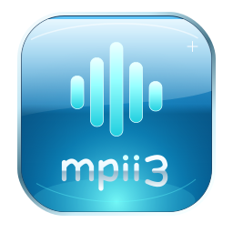

<p align="center"></p>
<h1 align="center">mpii3</h1>
<p align="center">A Wii homebrew music player with playlists and audio-reactive visuals.</p>

**Development alpha.** The Wii executable builds successfully; portable core tests run with address and undefined-behavior sanitizers. Playback, controller behavior, and rendering still need validation on real Wii hardware. This is an independent homebrew project.

## Current implementation

- Recursively discovers MP3 files and M3U/M3U8 playlists under `sd:/Music` and `usb:/Music`.
- Streams MP3 audio through libogc/libmad, with play/pause, previous/next, volume, automatic advance, and off/all/one repeat modes.
- Supports relative playlist paths, UTF-8 BOMs, CRLF, EXTINF titles, and Windows path separators. Missing files, non-MP3 entries, and network URLs are skipped.
- Displays a 32-subband spectrum derived from decoded audio, with spectrum and orbit views.
- Live visualizer settings: **8 / 16 / 32 bars**, sensitivity **0.5–3×**, response **0.25–3×**, and smoothing **0–95%**.
- Renders with **GRRLIB**, with an embedded TrueType font and original Aero-style SVG/PNG branding.
- Persists visualizer settings in the app's own `settings.ini`. Music files are opened read-only.

## Install a development build

Download the `mpii3-homebrew` artifact from a successful [Actions run](https://github.com/S1mplector/mpii3/actions). Extract its ZIP to an SD card or USB device:

```text
apps/mpii3/
  boot.dol
  icon.png         # 128 × 48 PNG
  meta.xml
Music/
  Artist/Album/song.mp3
  Playlists/example.m3u
```

Launch **mpii3** from the Homebrew Channel. The app scans the `Music` directory on both mounted devices. It does not install a Wii Menu channel or alter IOS. No music is bundled.

Example `Music/Playlists/example.m3u`:

```m3u
#EXTM3U
#EXTINF:-1,Artist - Song
../Artist/Album/song.mp3
```

## Wii Remote controls

| Button | Music browser | Visualizer settings |
|---|---|---|
| Up / Down | Select a track or playlist; hold to scroll | Select an option |
| A | Play selection; pause/resume the current track or active playlist | Reset visualizer defaults |
| Left / Right | Previous / next track | Decrease / increase the selected value |
| + / − | Volume | Volume |
| 1 | Switch music / playlist lists | — |
| 2 | Cycle repeat off / all / one | Cycle repeat |
| B | Open visualizer settings | Close and save settings |
| HOME | Save changed settings and exit | Save changed settings and exit |

Settings affect the live visualizer immediately. If the app directory is not writable, they work for the current session and the UI reports that saving failed. Bar count groups the decoder's 32 real frequency subbands; it does not invent extra frequency detail. Sensitivity changes displayed amplitude, response changes animation speed, and smoothing controls motion damping. At 0% smoothing, bars follow the measured values directly.

## Build

Install devkitPro's `wii-dev` tools and PPC port libraries (`freetype`, `libpng`, `libjpeg`, `bzip2`, `brotli`, `zlib`). The pinned official devkitPro container used by CI includes them.

```sh
git clone --recurse-submodules https://github.com/S1mplector/mpii3.git
cd mpii3
. scripts/env.sh
make -j4
make package
```

Outputs: `build/mpii3.dol`, `build/mpii3.elf`, and `dist/mpii3-0.1.0-alpha.1.zip`.

With Docker, run from the repository directory:

```sh
docker run --rm -v "$PWD:/work" -w /work \
  devkitpro/devkitppc@sha256:4c919aa26151dd43d88ca28c922d1fe2409579a8ba60ef56517baf1abdfb1a48 \
  make -j4 package
```

Run portable tests on Linux with a C compiler:

```sh
make test
```

The GRRLIB dependency is a pinned Git submodule. `make` compiles it within this project rather than installing it globally. `scripts/env.sh` supports a standard SDK in `/opt/devkitpro`, a user-provided `DEVKITPRO`, or the isolated SDK at `~/.local/share/mpii3-sdk/opt/devkitpro`.

## Architecture

See [architecture](docs/ARCHITECTURE.md) for module boundaries, [validation](docs/VALIDATION.md) for tested and untested behavior, and [roadmap](docs/ROADMAP.md) for next work.

Limits are explicit: 2,048 tracks per library/queue, 256 discovered playlists, 16 nested directory levels, and 767-byte file paths. The UI reports library capacity limits. This alpha supports local MP3s; streaming URLs, nested playlists, seeking, shuffle controls, ID3 artwork, gapless playback, and dynamic rescanning are not implemented yet.

## Artwork and license

The editable [logo](assets/logo.svg) and [Homebrew icon](assets/icon.svg) are SVGs. Their PNG exports are checked in. To regenerate: install `cairosvg`, then run `python3 scripts/render-assets.py`. The Homebrew icon is **128×48**, and the larger PNG is **256×256**.

Project code and original artwork: **GPL-2.0-or-later**. Third-party libraries and the bundled DejaVu font retain their own licenses; see [THIRD_PARTY.md](THIRD_PARTY.md).
